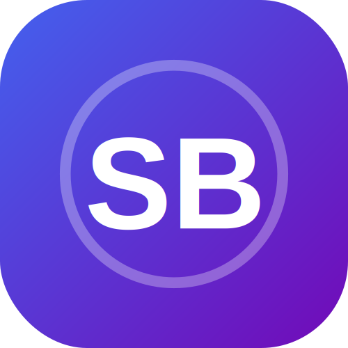

# 
StationByte.com

  

## ✨ Overview

Welcome to StationByte.com - Your Digital Innovation Hub! 🚀

We're building a vibrant community where technology enthusiasts, developers, and digital creators come together to share knowledge, collaborate, and shape the future of tech.

## 🌟 Key Features

### 🎯 Core Features
- **Modern Design**: Sleek, responsive interface that works beautifully on all devices
- **Lightning Fast**: Optimized performance for the best user experience
- **User-Friendly**: Intuitive navigation and clear content structure
- **Cross-Platform**: Seamless experience across all major browsers and devices

### 💡 Innovation
- Real-time updates and notifications
- Interactive community features
- Advanced search capabilities
- Personalized user experience

## 🛠️ Tech Stack

## 🔗 Quick Links

[🌐 Live Website](https://stationbyte.com) • 

## 📫 Get in Touch

Have questions or want to collaborate? We'd love to hear from you!

- 📧 Email: [contact@stationbyte.com](mailto:contact@stationbyte.com)

## 📝 License

This project is licensed under the terms of the license included in the repository. See the [LICENSE](LICENSE) file for details.

---

### Made with ❤️ by the StationByte Team

 